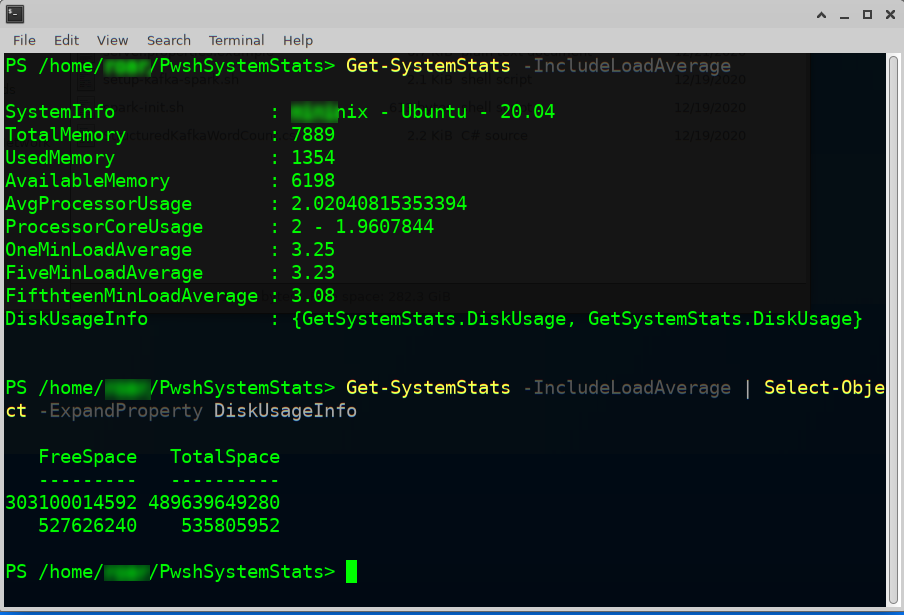

# PowerShell System Stats
Using a Rust library and FFI from .NET displays basic system stats in PowerShell

## Contents
* GetSystemStats - PowerShell binary Cmdlet with supporting classes and functions for FFI to Rust
* GetSystemStatsTest - XUnit tests for GetSystemStats
* system-stats - Rust based library of functions called from GetSystemStats

## Intentions
Simple, experiment with C# FFI to Rust, wrapped in a PowerShell Cmdlet. PowerShell provides a nice CLI user interface for administrators and operators.  Additionally generally annoying that Windows CLI/PowerShell doesn't provide a handy way to check resource usage in your shell. 

## TODO
* PowerShell built in help
* Rust Documentation
* PowerShell default output formatting
* Refactor SystemStatWarapper so each handle is it's own class

## Usage and Build
* Install Rust toolchain, .NET SDK 5, PowerShell 7 on your amd_64 platform of choice
* Build all the things, a sample PowerShell script to build is in Start-Build.ps1.  
* May need to adjust the build process for your platform specifics. 
* Output number formatting

```
# Using PowerShell
Import-Module GetSystemStats.dll
Get-SystemStats


SystemInfo              : computer.local - Darwin - 10.15.7
TotalMemory             : 16777
UsedMemory              : 16050
AvailableMemory         : 1936
AvgProcessorUsage       : 4.96198487281799
ProcessorCoreUsage      : 14 - 3.9215689 - 13.725491 - 3.9215689
OneMinLoadAverage       : 2.53759765625
FiveMinLoadAverage      : 2.54248046875
FifthteenMinLoadAverage : 2.4375
DiskUsageInfo           : {GetSystemStats.DiskUsage,            GetSystemStats.DiskUsage, 
                          GetSystemStats.DiskUsage}

```
